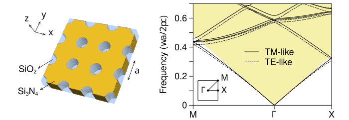

Computing a photonic-crystal slab band structure is only half of the problem; the modes must also be labeled correctly. In particular, Legume's `kz_symms` output is not the conventional TE-like/TM-like classification. This note shows how to recover that classification from the electric field of each mode.

The complete calculation is available in the [`nanocompute-learn`](https://github.com/angchen0325/nanocompute-learn/tree/main/tests/legume) repository.

## 1. Model system

Consider a mirror-symmetric square-lattice slab in Ref. <a href="#ref-2" id="ref-2-back" class="no-underline">[2]</a>. The silicon-nitride slab has refractive index $n_{\mathrm{Si_3N_4}}=2.02$, thickness $d=180\,\mathrm{nm}$, and period $a=336\,\mathrm{nm}$. Each unit cell contains a circular silica hole of radius $r=80\,\mathrm{nm}$, and the upper and lower claddings are silica with $n_{\mathrm{SiO_2}}=1.46$.

<figure style="width: 100%; margin: 2rem auto; text-align: center;">
  
  <figcaption style="font-size: 1.0rem; line-height: 1.3; text-align: left;"><b>Figure 1.</b> Left panel: Square-lattice silicon-nitride slab with circular silica holes and symmetric silica claddings. Right panel: TE-like and TM-like photonic bands.
  </figcaption>
</figure>

The structure is constructed in Legume as follows:

```py
import legume
import numpy as np

n_sin = 2.02
n_sio2 = 1.46
a = 336.0
slab_thickness = 180.0 / a
hole_radius = 80.0 / a

lattice = legume.Lattice("square")
phc = legume.PhotCryst(lattice, eps_l=n_sio2**2, eps_u=n_sio2**2)
phc.add_layer(d=slab_thickness, eps_b=n_sin**2)
phc.layers[-1].add_shape(
    legume.Circle(eps=n_sio2**2, r=hole_radius)
)
```

## 2. Full band calculation

We use Legume's guided-mode expansion (GME) along the $M\rightarrow\Gamma\rightarrow X$ path. Frequencies are reported in the dimensionless form $\omega a/(2\pi c)$. For cladding index $n_{\mathrm{clad}}$, the light line is

$$
\frac{\omega a}{2\pi c}
=
\frac{|\mathbf{k}_{\parallel}|a}{2\pi n_{\mathrm{clad}}}.
$$

Modes above this line lie in the cladding radiation continuum and can acquire a finite radiative linewidth.

```py
gme = legume.GuidedModeExp(phc, gmax=5, truncate_g="abs")
path = lattice.bz_path(["M", "G", "X"], [120, 84])

gme.run(
    kpoints=path["kpoints"],
    angles=path["angles"],
    gmode_inds=[0, 1, 2, 3],
    numeig=11,
    kz_symmetry="both",
    verbose=True,
)
```

This calculation uses 81 reciprocal-lattice vectors and returns 11 modes at each of 205 wavevectors. These settings are sufficient for the present comparison, but quantitative frequencies and quality factors should always be checked for convergence with respect to `gmax`, `gmode_inds`, and `numeig`.

<figure style="width: 100%; margin: 2rem auto; text-align: center;">
  <div style="min-height: 300px; border: 1px dashed #999; display: flex; align-items: center; justify-content: center; padding: 1.5rem; color: #666;">
    <b>Figure 2 placeholder:</b>&nbsp;raw GME bands along M-Gamma-X, with the silica light cone shaded and radiative <i>Q</i> represented by color or marker size.
  </div>
  <figcaption style="font-size: 1.0rem; line-height: 1.3; text-align: left;"><b>Figure 2.</b> Full GME spectrum. The shaded region above the silica light line is the radiation continuum.</figcaption>
</figure>

## 3. Why `kz_symms` is not TE/TM

Legume's `kz_symms` labels parity with respect to the vertical plane spanned by the propagation direction $\mathbf{k}_{\parallel}$ and $z$. This plane changes with the direction of $\mathbf{k}_{\parallel}$. By contrast, the conventional TE-like/TM-like classification of a mirror-symmetric slab refers to reflection through the horizontal slab mid-plane, $z\rightarrow-z$ <a href="#ref-1" id="ref-1-back" class="no-underline">[1]</a>.

For the electric field at $z=0$:

- A **TE-like** mode has predominantly in-plane electric field; its odd $E_z$ component vanishes at the mid-plane.
- A **TM-like** mode has a finite, typically dominant, out-of-plane component $E_z$ at the mid-plane.

The two labels therefore answer different symmetry questions and cannot be substituted for one another.

<figure style="width: 100%; margin: 2rem auto; text-align: center;">
  <div style="min-height: 280px; border: 1px dashed #999; display: flex; align-items: center; justify-content: center; padding: 1.5rem; color: #666;">
    <b>Figure 3 placeholder:</b>&nbsp;the same bands colored by `kz_symms`, illustrating that the solver labels do not reproduce the expected TE-like/TM-like branches.
  </div>
  <figcaption style="font-size: 1.0rem; line-height: 1.3; text-align: left;"><b>Figure 3.</b> Legume vertical-plane symmetry labels. They should not be interpreted directly as TE-like and TM-like polarization.</figcaption>
</figure>

## 4. Repairing the acoustic modes at Gamma point

In this calculation, the GME basis at the exact $\Gamma$ point contains 313 states, compared with 314 at its two neighboring wavevectors. Inspection of the guided-mode blocks shows that one TM basis component is absent when $\mathbf{G}+\mathbf{k}=0$. Consequently, Legume returns only one near-zero acoustic mode at $\Gamma$, although both the TE-like and TM-like branches approach zero.

Before classifying or connecting the bands, we duplicate the computed zero into the missing physical branch and shift the remaining $\Gamma$-point data by one index. The same operation must be applied to the frequencies, losses, symmetry labels, and field-derived quantities. This is an alignment correction specific to the observed basis drop; it should not be applied without first verifying the neighboring basis sizes.

```py
def restore_missing_gamma_mode(values, gamma_index, inserted_value=None):
    """Insert the TM acoustic branch omitted at the exact Gamma point."""
    repaired = np.asarray(values).copy()
    repaired[gamma_index, 1:] = repaired[gamma_index, :-1]
    if inserted_value is not None:
        repaired[gamma_index, 1] = inserted_value
    return repaired
```

## 5. Field-based classification

For every mode, Legume provides the Fourier coefficients of the electric field. We define a mid-plane TM fraction

$$
f_{\mathrm{TM}}
=
\frac{\sum_{\mathbf{G}}|E_z(\mathbf{G},z=0)|^2}
{\sum_{\mathbf{G}}\left(|E_x|^2+|E_y|^2+|E_z|^2\right)}.
$$

Modes with $f_{\mathrm{TM}}\geq0.1$ are labeled TM-like; the remainder are labeled TE-like. The threshold is a practical separator for this structure, not a universal constant. It should be validated by inspecting the distribution of $f_{\mathrm{TM}}$, especially for asymmetric slabs or strongly hybridized modes.

```py
def compute_midplane_tm_fraction(gme, z=0.0):
    """Return the fractional mid-plane electric-field power in Ez."""
    frequencies = np.asarray(gme.freqs, dtype=float)
    tm_fraction = np.full(frequencies.shape, np.nan)

    for k_index in range(frequencies.shape[0]):
        for mode_index in range(frequencies.shape[1]):
            ex_ft, ey_ft, ez_ft = gme.ft_field_xy(
                "E", k_index, mode_index, z
            )
            component_power = np.array([
                np.sum(np.abs(ex_ft) ** 2),
                np.sum(np.abs(ey_ft) ** 2),
                np.sum(np.abs(ez_ft) ** 2),
            ])
            if component_power.sum() > 0:
                tm_fraction[k_index, mode_index] = (
                    component_power[2] / component_power.sum()
                )

    return tm_fraction
```

After classification, modes of the same polarization are connected between adjacent wavevectors by frequency continuity. This produces six visible TE-like branches and five visible TM-like branches below $\omega a/(2\pi c)=0.70$ for the selected numerical settings.

<figure style="width: 100%; margin: 2rem auto; text-align: center;">
  <div style="min-height: 320px; border: 1px dashed #999; display: flex; align-items: center; justify-content: center; padding: 1.5rem; color: #666;">
    <b>Figure 4 placeholder:</b>&nbsp;final field-classified band diagram, with TM-like modes as solid lines, TE-like modes as dashed lines, and the silica light cone shaded.
  </div>
  <figcaption style="font-size: 1.0rem; line-height: 1.3; text-align: left;"><b>Figure 4.</b> Reconstructed polarization-resolved bands. Solid and dashed curves denote TM-like and TE-like modes, respectively.</figcaption>
</figure>

## 6. Summary

The central point is simple: solver symmetry labels and physical polarization labels are not automatically equivalent. For this symmetric slab, TE-like and TM-like modes are most directly identified from their electric-field content at the slab mid-plane. The classification should be performed only after checking the special handling of the acoustic modes at $\Gamma$, and any quantitative conclusion should be supported by a basis-convergence test.

## References

<ol>
  <li id="ref-1">
    John D. Joannopoulos, Steven G. Johnson, Joshua N. Winn, and Robert D. Meade.
    <i>Photonic Crystals: Molding the Flow of Light</i>, 2nd ed., Princeton University Press (2008).
    <a href="#ref-1-back" aria-label="Back to citation">
      <i class="fa-solid fa-reply" aria-hidden="true"></i>
    </a>
  </li>

  <li id="ref-2">
    Chia Wei Hsu, Bo Zhen, Jeongwon Lee, Song-Liang Chua, Steven G. Johnson, John D. Joannopoulos, and Marin Solja&#269;i&#263;.
    <i>Observation of trapped light within the radiation continuum</i>, Nature <b>499</b>, 188-191 (2013).
    <a href="#ref-2-back" aria-label="Back to citation">
      <i class="fa-solid fa-reply" aria-hidden="true"></i>
    </a>
  </li>
</ol>
